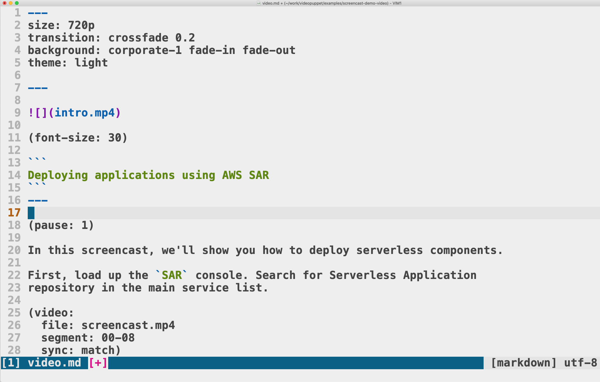

(pause: 3)


(font-size: 30)

```
Deploying applications using AWS SAR
```

---

(pause: 1)

In this video, we'll show you how to deploy serverless components.

First, load up the `SAR` console. Search for Serverless Application 
repository in the main service list.


---


When the `SAR` console loads, click the available applications link in the left-hand menu. 

You will see a list of components published by other users. 

Use the search box to quickly find an interesting component.

---

For example, type `ffmpeg` to find components that can help with video conversion.


AWS does not run a full security check on these components, so you have to be a bit careful about what you install. 

They do have a verified author program, which at least gives you some peace of mind that the source is trustworthy. 

---


(callout:
  type: rectangle
  left: 750
  top: 580
  right: 920
  bottom: 650)

For example, the `ffmpeg` lambda layer component was published by a verified author, which you can see in the listing.

---


Click the application name to see the details.

---

(transition: wipe 0.2)


Once the page loads, scroll all the way to the bottom to 
find the Deploy button.

---

Click the button to install the component. This can take a while, depending on what you install.


---

(transition: wipe 0.2)

Eventually you'll see a screen with the application details. Click the Deployments tab in the middle.


---


`SAR` components are just CloudFormation stacks, and you can easily see the resources of the application.


---


Find the CloudFormation stack link at the top of the deployments tab, and click it.


---


You'll see the standard CloudFormation stack web page. Open the Resources tab.

---


Here you'll find a list of all the resources in the `SAR` component. In this case, you can find
the `ARN` of the deployed layer, ready to use in your Lambda functions.

---


(pause: 1)

(font-size: 30)

```
Built from Markdown using Narakeet!
```

You can create videos like this one easily using Narakeet. 

---

Just create a markdown script with the narration, and upload it 
along with your assets.



---


The narration you hear now was generated from a markdown script, 
and the video was automatically composed from screen grabs.

---

```md
* Automate narration
* Automatically synchronise audio and video
* Show text on top of videos or images
* Edit videos as easily as editing text
```


Stop wasting time on recording voice, synchronising picture with sound and adding subtitles.

Let Narakeet do all the dull tasks, so you can focus on the content.

Edit videos as easily as editing text.

---

Download the source of this video and check out more information at narakeet.com

(font-size: 40)

```
narakeet.com
```

(pause: 3)

